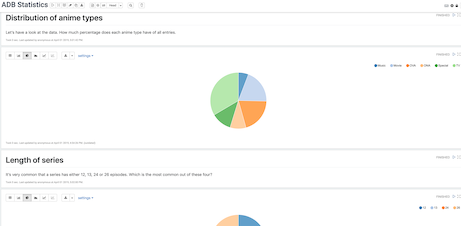

# adb-zeppelin-statistics

Stands for _anime database zeppelin statistics_. This project contains a notebook for [Apache Zeppelin](https://zeppelin.apache.org). You can use this as a start to identify interesting statistics or insights based on the [anime-offline-database](https://github.com/manami-project/anime-offline-database).

<p align="center">
  
</p>

## Usage (using docker)

1. Pull and run docker container
```
docker pull apache/zeppelin:0.8.1
docker run -d -p 8080:8080 apache/zeppelin:0.8.1
```
2. Open the web interface `http://127.0.0.1:8080`
3. Click on `Import note`
4. Click on `Select JSON file`
5. Select the note from this repository
6. Have fun

## Contributions
Got something funny or cool to add to the statistics? Create a pull request.